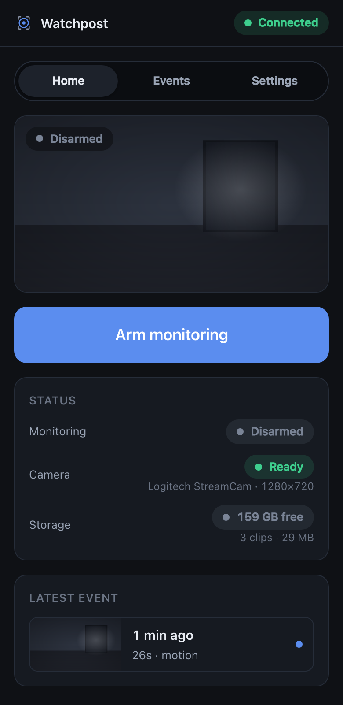
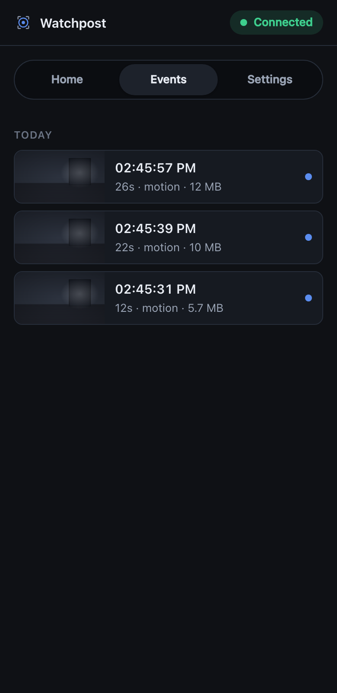
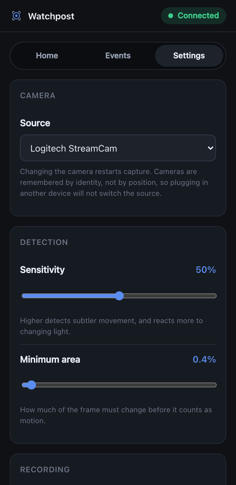
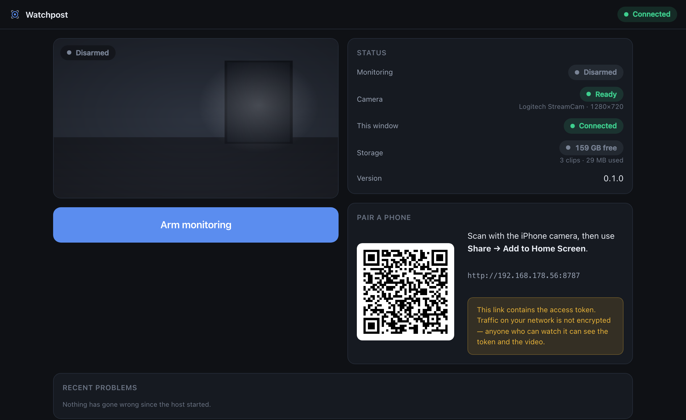
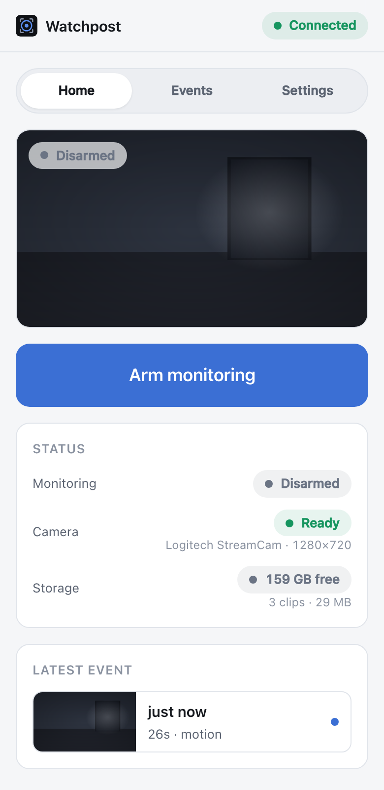
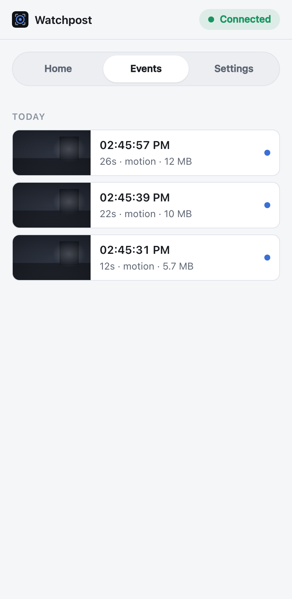

<div align="center">


# Watchpost

**Turn a MacBook and a USB camera into a private security monitor you check from your phone.**

No cloud. No account. No subscription. Nothing leaves your network.

[](https://github.com/VitalyVorobyev/watchpost/actions/workflows/ci.yml)
[](LICENSE)
[](#requirements)
[](server/pyproject.toml)
[](web/package.json)
[](src-tauri/Cargo.toml)
[](docs/adrs/0001-local-first-single-host.md)





</div>

---

## What it does

You already own a laptop and a webcam. Watchpost turns them into a monitoring system in about
two minutes, with no hardware to buy and no service to sign up for.

- **Records only what matters.** Continuous motion detection, and a clip is written when
  something happens — including the seconds *before* the trigger, so you see what led up to it.
- **Your phone is the remote.** Arm, disarm, watch the live view, and play back clips from
  Safari on the same Wi‑Fi. Scan a QR code once to pair.
- **Everything stays on the Mac.** No uploads, no telemetry, no outbound requests of any kind.
  It works with the internet unplugged.
- **Cleans up after itself.** Retention runs on three limits at once — clip count, total size,
  and age — so storage never quietly fills.
- **Cheap on the machine.** Hardware H.264 encoding via VideoToolbox; capture runs at real time
  with the CPU essentially idle.

## Quick start

```bash
brew install ffmpeg

git clone https://github.com/VitalyVorobyev/watchpost.git
cd watchpost

cd web && bun install && bun run build && cd ..
cd server && uv sync && uv run watchpost serve
```

The terminal prints two links:

```
  Watchpost
    Mac      http://127.0.0.1:8787/host?t=<token>
    Phone    http://192.168.1.42:8787/?t=<token>
    Storage  /Users/you/Library/Application Support/Watchpost
```

Both links carry the access token, and the client removes it from the address bar as soon as
it has stored it.

Open the Mac link, then scan the QR code with your iPhone and choose **Share → Add to Home
Screen**. That is the whole setup.

<div align="center">

</div>

### As a desktop app

```bash
cargo tauri dev
```

The desktop shell supervises the same server and opens the host screen in its own window.
macOS asks for camera permission the first time — and again if you switch between the terminal
and the app, because the permission belongs to whichever one launched the capture.

## Requirements

| | |
|---|---|
| **macOS** | 12 or newer. Any USB/UVC camera, or the built-in one. |
| **[ffmpeg](https://ffmpeg.org)** | `brew install ffmpeg` — capture and encoding. |
| **[uv](https://docs.astral.sh/uv/)** | Runs the Python host. |
| **[bun](https://bun.sh)** | Builds the web client. |
| **Rust + [cargo-tauri](https://tauri.app)** | Only for the desktop app. |

## How it works

One `ffmpeg` process opens the camera and feeds two things at once: decoded frames for motion
detection and the live preview, and a continuous H.264 **segment ring** on disk. When motion
triggers, the clip is assembled by concatenating the ring segments that span the event — a
stream copy, with no re-encode.

```
                                  ┌─▶ frames ─▶ motion detector ─▶ event recorder ─┐
  USB camera ──▶ ffmpeg ──────────┤                                                │
                                  └─▶ 2-second H.264 segments (ring) ──────────────┤
                                                                                   ▼
                                                                    concat -c copy ──▶ clip.mp4
                                                                                   │
   iPhone ◀── REST + SSE ──── FastAPI ◀── authoritative state ◀── SQLite + files ◀──┘
```

That design is why pre-roll costs bounded disk instead of hundreds of megabytes of RAM, why
clip creation is instant and lossless, and why an event survives a crash of the host process.

**Read more:** [design](docs/design.md) · [roadmap](docs/roadmap.md) ·
[backlog](docs/backlog.md) · [architecture decisions](docs/adrs/)

## Where your recordings live

```
~/Library/Application Support/Watchpost/
  clips/         event clips (.mp4)
  thumbs/        thumbnails
  ring/          transient buffer — churns constantly, never back this up
  watchpost.db   event metadata
  config.json    your settings
  token          pairing secret, mode 0600
```

Deleting an event deletes its clip. Nothing is uploaded anywhere, ever.

## Honest limitations

Worth knowing before you rely on it.

- **The lid has to stay open.** Closing it suspends the Mac and stops monitoring. Watchpost
  blocks display and idle sleep while armed, but no software can defeat a closed lid without an
  external display and power.
- **LAN traffic is unencrypted.** The pairing token and the video are visible to anyone who can
  observe your network. That is a deliberate trade for setup simplicity on a home network —
  see [ADR-0006](docs/adrs/0006-lan-http-token-auth.md). TLS is the top item in Phase 2.
- **No offline mode or push notifications on iOS.** A plain-HTTP LAN origin is not a secure
  context, so Service Workers and Web Push are unavailable until TLS lands
  ([ADR-0009](docs/adrs/0009-ios-platform-constraints.md)).
- **Motion detection is motion detection.** It will fire on changing light, shadows, and pets.
  Person detection is Phase 3, behind the existing detector interface.
- **Video only.** No audio is captured or recorded, deliberately.
- **One camera, one Mac, one household.** Multiple cameras and users are explicit non-goals.

## Development

```bash
# Server
cd server
uv run pytest                    # tests
uv run ruff check . && uv run ruff format .
uv run watchpost cameras         # list cameras with their stable identities

# Web client
cd web
bun run dev                      # Vite dev server, proxies /api to :8787
bun run typecheck && bun run test

# Desktop shell
cd src-tauri
cargo clippy --all-targets -- -D warnings
cargo tauri build
```

The host is a standalone process — the desktop shell supervises it but never contains it, so
the server and the phone client keep working with the shell absent or broken.

CI runs lint, typecheck, tests, and builds for all three components, plus an end-to-end check
that the host boots, serves the client, and rejects unauthenticated requests.

## Screenshots

The camera view in these screenshots is a synthetic placeholder — everything else is real
application state.

<div align="center">


</div>

## License

[MIT](LICENSE) © Vitaly Vorobyev
